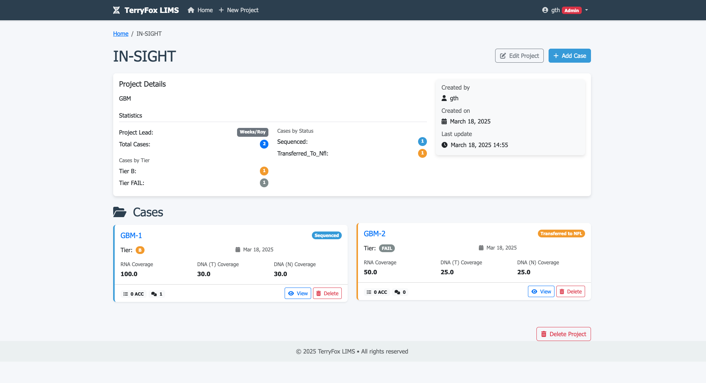

# TerryFox LIMS

A custom Laboratory Information Management System (LIMS) for the TerryFox project. This system allows tracking of projects, cases, and their associated data such as sequencing status, coverage information, and accession numbers.

## Features

- Project management
- Case tracking with status monitoring
- Coverage information (RNA, DNA-T, DNA-N)
- Tier classification (A, B, FA)
- Accession number management
- Comment system for cases
- Role-based permissions (Admin, PI, Bioinformatician)
- Beautiful and user-friendly interface

## Overview

   

## Requirements

- Python 3.8+
- Django 5.0+
- Conda environment with Django installed

## Installation

### Prerequisites
- Python 3.8+
- Git

### Setup

1. Clone the repository:
   ```bash
   git clone https://github.com/acri-nb/terryfox-lims.git
   cd terryfox-lims
   ```

2. Choose one of the following installation methods:

#### Option A: Using pip (recommended)
   ```bash
   # Create and activate a virtual environment (optional but recommended)
   python -m venv venv
   source venv/bin/activate  # On Windows use: venv\Scripts\activate
   
   # Install dependencies from requirements.txt
   pip install -r requirements.txt
   ```

#### Option B: Using Conda
   ```bash
   # Create and activate a Conda environment
   conda create -n terryfox python=3.9
   conda activate terryfox
   
   # Install dependencies
   pip install -r requirements.txt
   ```

3. Run migrations to set up the database:
   ```bash
   python manage.py makemigrations
   python manage.py migrate
   ```

4. Create a superuser account:
   ```bash
   python manage.py createsuperuser
   ```

5. Run the development server:
   ```bash
   python manage.py runserver
   ```

6. Visit `http://127.0.0.1:8000/` to access the application
   - For admin access, go to `http://127.0.0.1:8000/admin/`
   - Use the admin panel to create required user groups:
     - Create "PI" group (Read-only access)
     - Create "Bioinformatician" group (CRUD access)
     - Assign users to these groups

## User Roles

- **Superuser/Admin**: Full access to all features and admin panel
- **PI (Principal Investigator)**: Read-only access to view projects and cases
- **Bioinformatician**: Full CRUD permissions (Create, Read, Update, Delete) on projects and cases

## Usage

1. Login with your user credentials
2. From the dashboard, you can see all projects
3. Click on a project to view its cases
4. Click on a case to view its details, including status, coverage information, and accession numbers
5. Bioinformaticians can create, edit, and delete projects and cases
6. PIs can view all information but cannot make changes

## Development

This project follows standard Django application architecture:

- `core/models.py`: Database models
- `core/views.py`: View functions
- `core/forms.py`: Forms for data input
- `core/admin.py`: Admin interface configuration
- `templates/`: HTML templates
- `static/`: Static files (CSS, JS, images)

## License

© IARC - International Agency for Research on Cancer

## Contact

For any questions or support, please contact the development team. 