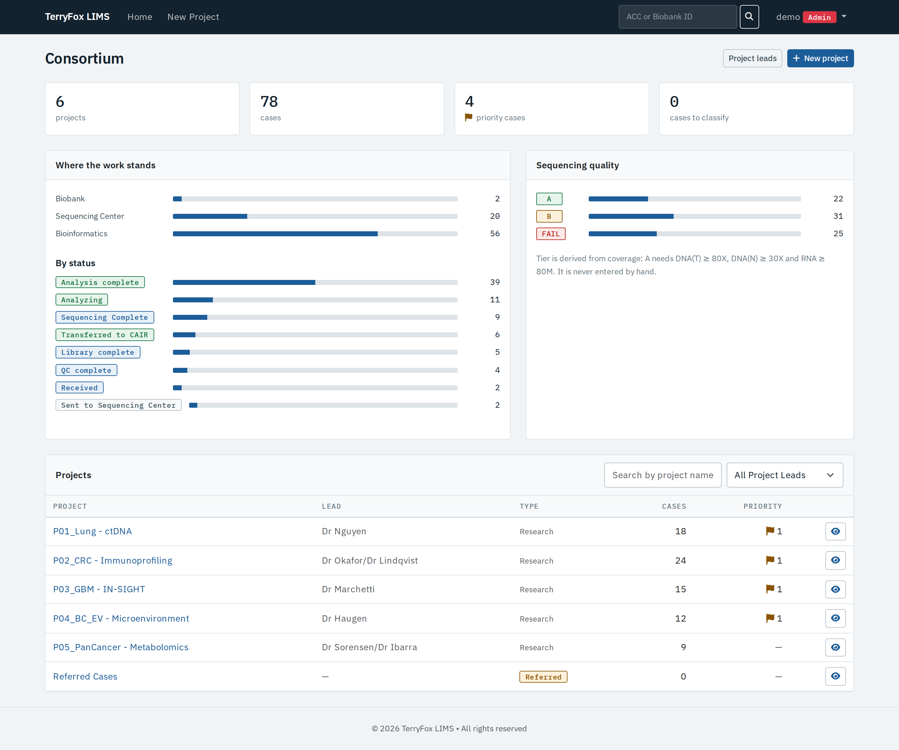
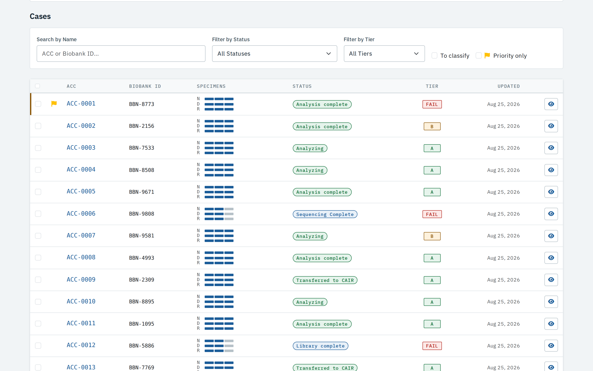
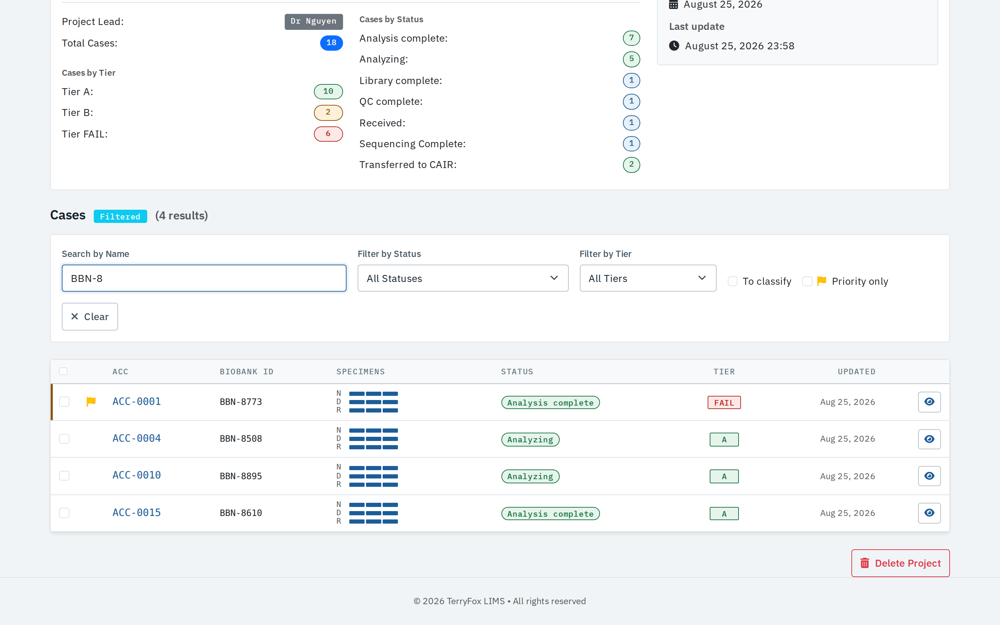
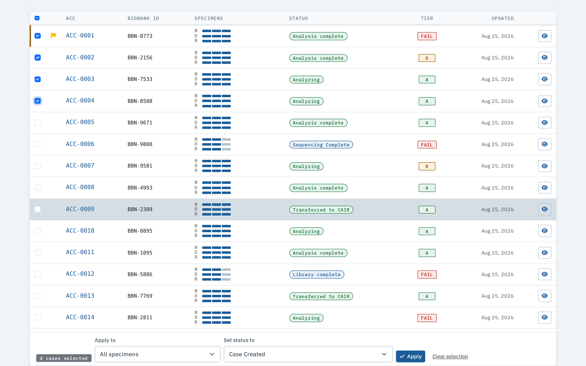
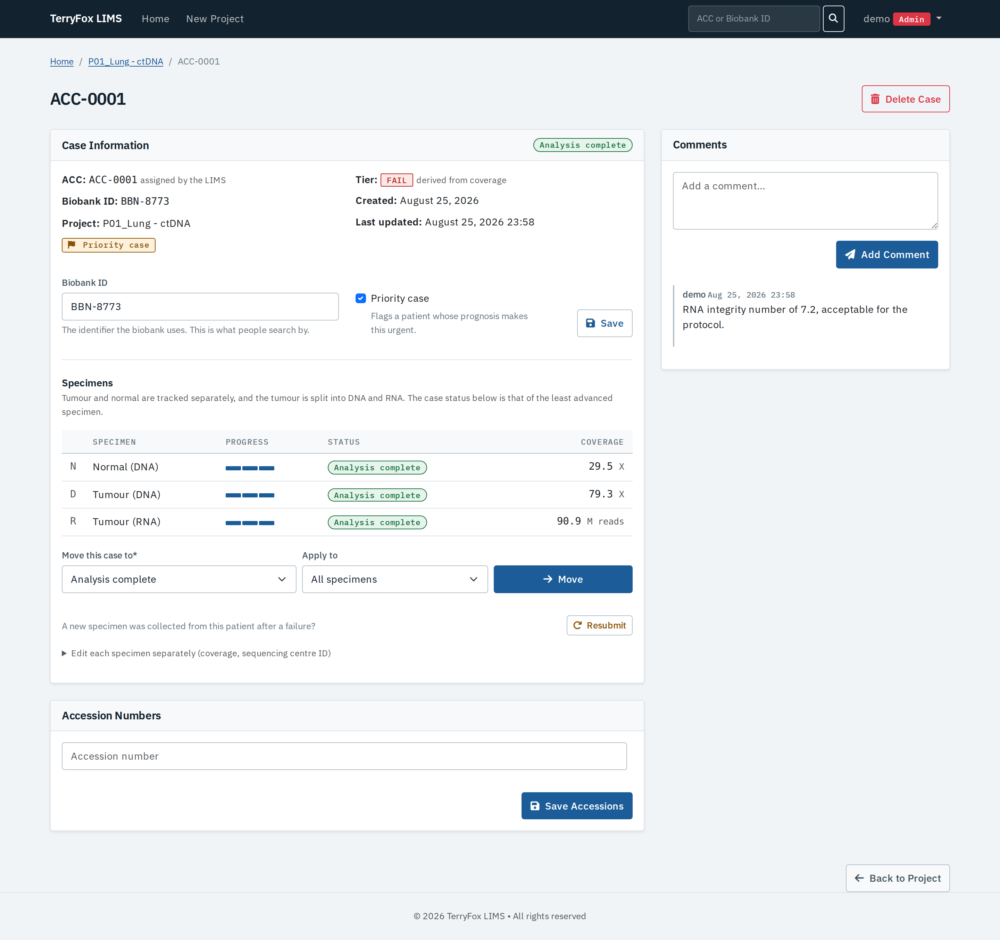

# TerryFox LIMS

A Laboratory Information Management System for the TerryFox / ACRI cancer genomics
consortium. It tracks research projects, the cases inside them, the specimens inside each
case, and the sequencing coverage that determines a case's tier.

Django 5, server-rendered templates, SQLite. No build step, no JavaScript framework, no CDN
at runtime.



> Every screenshot on this page uses synthetic data generated by `ops/seed_demo.py`. No real
> biobank identifier appears in this repository.

## What it does

### Cases hold specimens, and specimens are tracked separately

Tumour and normal are distinct entities inside a case, and the tumour is split into DNA and
RNA. Each of the three moves through the workflow on its own, which is what the sequencing
centre actually reports: RNA can still be pending while both DNA specimens are analysed.

A case is not forced to have three. A protocol that does not collect RNA gives its cases
two, and nothing shows as perpetually incomplete.



The `N` / `D` / `R` column shows each specimen's stage at a glance. The case status is
derived: it is the least advanced specimen whose state is known, so one pending RNA does not
make a finished analysis read as unfinished, and an unclassified specimen does not make it
read as finished either.

### Identifiers: one assigned, one searched

`ACC-0142` is allocated by the LIMS and never entered by hand. A freed number is never
reused, because it may already be on a freezer label.

The **Biobank ID** is what people actually search by, in the project filter and in the
consortium-wide search box. It is checked for duplicates across all projects, but the check
is a warning naming the conflicting case, not a hard block: two projects legitimately share
a numbering space, and a technician must still be able to record the patient's real
identifier.

### The filter applies as you type

There is no *Filter* button and nothing to clear. Type in the field or pick from a menu, and
the list follows. Filtering stays on the server, so it is correct across pagination; the
address bar follows the filter, so a filtered view can be bookmarked and shared.



Without JavaScript the form still works the old way, button included.

### Status changes in batches, and they can be undone

Tick the cases, pick a status, apply. Shift-click selects a range. The whole batch is one
transaction, and undoing it restores only the specimens still sitting at the value the batch
set, so work done in between is never overwritten.



### The rest

- **Tier** (A / B / FAIL) derived from coverage, never entered by hand
- **Priority flag** set at creation, pinning a case to the top of every list
- **Resubmit** after a sequencing failure: a new attempt under the *same* ACC, the previous
  one archived read-only with its comments and coverage left where they happened
- **Exports** per project and consortium-wide, as CSV or a ZIP bundle with specimens,
  comments and archived attempts
- **Referred Cases**, a project kind distinct from research projects
- **Comments** per case, kept with the attempt they belong to
- **Soft delete**: removing a project or a case sets a flag, it does not issue a `DELETE`



## Statuses

Ten statuses in three stages, which is also the order the work happens in:

| Stage | Statuses |
|---|---|
| Biobank | Case Created · Sent to Sequencing Center |
| Sequencing Center | Received · QC complete · Library complete · iSeq finished · Sequencing Complete |
| Bioinformatics | Transferred to CAIR · Analyzing · Analysis complete |

Rows inherited from V1 carry a transition status. It is absent from the entry menus and
present in the filters, so the cases that need reclassifying can be found and worked through
in batches.

## Tier

`Case.save()` always overwrites the tier with the value derived from coverage. Setting it in
a form, a fixture, or the admin has no effect.

| Tier | Condition |
|---|---|
| **FAIL** | either DNA value missing, or below 30X |
| **A** | DNA(T) ≥ 80X and DNA(N) ≥ 30X and RNA ≥ 80M reads |
| **B** | otherwise, when DNA(N) ≥ 30X and DNA(T) ≥ 30X |

Changing a threshold does **not** retroactively update existing rows — they must be re-saved
(`update_tier_b_criteria.py`). History is in `docs/TIER_CRITERIA_UPDATED.md`.

## Requirements

- Python 3.8+ and Django 5.0+
- The other packages are in `requirements.txt`: gunicorn, whitenoise, python-decouple,
  django-crispy-forms and crispy-bootstrap5

Bootstrap, FontAwesome and the IBM Plex fonts are vendored under `static/`. An internal lab
server should not depend on a CDN to render.

Production additionally needs systemd, SSL certificates in `/root/ssl/`, root access for
port 443, and `/var/log/terryfox-lims/`.

## Installation

```bash
git clone https://github.com/acri-nb/terryfox-lims.git
cd terryfox-lims
pip install -r requirements.txt

python manage.py migrate
python manage.py createsuperuser
python manage.py runserver
```

Then visit `http://127.0.0.1:8000/`. The `viewer` and `editor` groups are created
automatically; assign their permissions and their members through the admin.

## Tests

```bash
python manage.py test core                    # 102 tests
python manage.py test core.tests.TierCalculationTests
```

They cover the tier rules, soft delete, CSV import, identifiers, specimens, bulk status,
resubmit, exports, permissions, and the static assets rendered with the production storage.

Two extras need optional tooling and skip without it:

```bash
# The live filter, actually executed in a DOM against a live server
npm install jsdom@24
LIMS_JSDOM=$PWD/node_modules/jsdom python manage.py test core.test_e2e_livefilter

# Regenerate the screenshots on this page
pip install playwright && python -m playwright install chromium
python ops/screenshots.py
```

## Production

The service is already installed. **Never run `manage.py migrate` by hand on the server** —
`ops/deploy.sh` is the only path:

```bash
sudo ./ops/deploy.sh <label>
```

It stops the watchdog (which would otherwise restart the service mid-migration), takes a
verified labelled backup, freezes a set of invariants, migrates, compares them again, and
**restores automatically** on any drift that was not declared. It ends by checking that the
application answers.

```bash
sudo systemctl status terryfox-lims.service
sudo journalctl -u terryfox-lims.service -f
tail -f /var/log/terryfox-lims/{access,error,watchdog}.log
./ops/status.sh
```

The application answers on **https://candig-lims.cair.mun.ca**, on
**https://10.220.115.67**, and on **https://localhost**. The certificate is self-signed, so
the browser warns on first visit.

### Data safety

The production database lives **outside the git tree**, at
`/var/lib/terryfox-lims/db.sqlite3`, so no git command in this repository can reach live
data. Hourly verified backups run from `terryfox-lims-backup.timer`, with 48 hourly, 30
daily and 12 monthly kept; a `--label` copy is kept forever.

`ops/check_invariants.py` is the gate that compares counts, tiers, statuses, orphans and
duplicates around a deployment. `ops/selftest.py` proves the gate itself still catches what
it claims to. Details in `ops/README.md`.

Run `ops/backup_db.py` before anything that writes.

## Roles

| Role | Access |
|---|---|
| Superuser | Everything, including user management and the consortium export |
| `editor` | Create, edit and delete projects, cases and project leads |
| `viewer` | Read-only |

Project and case views use Django model permissions. User-management views check
`is_superuser` directly. Generated passwords are shown once, at creation.

## Importing cases

Two ways to add many cases at once, both under *Add Cases* on a project page.

**In batch**: paste Biobank IDs, one per line, and tick which specimens this protocol
collects. The LIMS assigns the ACC numbers.

**From CSV**: required headers are `CaseID,Status,DNAT,DNAN,RNA`, plus `Biobank_ID`
(`Other_ID` from V1 is still accepted). Cases are matched by name within the project and
upserted. An empty cell means *unchanged* — it does not erase the existing value.

```csv
CaseID,Biobank_ID,Status,DNAT,DNAN,RNA
ACC-0123,BBN-1204,Received,,,
ACC-0124,BBN-1205,Analysis complete,92,31,81
```

A template is available for download on the import page.

## Layout

```
core/models.py      ProjectLead → Project → Case → {Specimen, Accession, Comment}
core/views.py       every view, all function-based
core/forms.py       model forms plus the batch / CSV / filter / user forms
core/statuses.py    the status vocabulary and the V1 mapping
core/exports.py     CSV and ZIP exports, stdlib only
templates/core/     one template per view
static/css/lims.css the whole design layer
static/js/          live filtering; bulk selection lives in its template
ops/                backups, invariants, deployment, screenshots
```

## Documentation

- `docs/RAPPORT_V2_SYNTHESE.md` — what changed in V2 and why, in three pages
- `docs/RAPPORT_V2.md` — the same, in full
- `ops/README.md` — backups, invariants, deployment, restore
- `docs/PRODUCTION.md`, `docs/NGINX_DEPLOYMENT.md`, `docs/HTTPS.md` — deployment guides
- `CLAUDE.md` — developer orientation

## License

ACRI — Atlantic Cancer Research Institute
